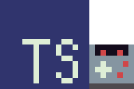

# TSC-80 - TypeScript for the TIC-80



Write your [TIC-80](https://tic.computer/) games in TypeScript. Works with the free version of TIC-80.

Tested with TIC-80 version 0.60.3 on Windows, and should work on all TIC-80 compatible platforms.

## Installation and usage

TSC-80 requires a bit of setup, but once it is done, it's as easy as `tsc80 run` to inject your TypeScript code into TIC-80 :)

### Pre-requisites

- Install NodeJS 6+
- Install TypeScript (`npm install -g typescript`)
- Create and save an empty JavaScript game in TIC-80 (`new js` then `save myjsgame`)

### Install TSC-80 and create a boilerplate project

- `$ npm install -g tic80-typescript`
- `$ tsc80 init` will create the necessary files (config, index.ts and declarations) into the current directory
- Set the correct values inside the `tsc80-config.json` (see below)

### Configuration

You need to complete the `tsc80-config.json` for each project. **All fields are required.**

```js
{
  "game": { // Some information about your game
    "author": "game developer",
    "title": "Your cart's title",
    "desc": "short description",
    "input": "gamepad", // Or "mouse"
    "cart": "myjsgame.tic", // The name of your TIC cart. Must end with ".tic"
    "backup": true // Copy your cart from the TIC folder to your project folder. Backup it with git!
  },
  "tic": {
    "ticExecutable": "path/to/tic/executable/file", // The path to your TIC executable.
    "cartsDirectory": "path/to/tic/carts/folder" // The directory where TIC stores its carts. Accessible from TIC with the "folder" command
  },
  "compression": { // These settings will alter how the final js file will look like
    "compressedFile": "build/compressed.js", // Path to compressed file. You should not have to change this.
    "indentLevel": 1,
    "compress": true,
    "mangle": true
  }
}
```

### Run TSC-80

- `$ tsc80 run` will compile, compress, and launch your game through the TIC-80.
- Once that TIC-80 is running, you can save your game cart with `save`.

If the backup option is set, the resulting `.tic` file will be automatically copied in your project directory when you close TIC-80.

Do note that if you happen to manually edit the `tsconfig.json` file, it is required to keep the `compilerOptions.outFile` option.

## More

### Code organization

With the default `tsconfig.json`, TSC-80 will build all `.ts` files in your project folder, in no particular order. 
This may cause some problems, as some initialization code may be called before all the required classes/functions are read, leading to `undefined` errors.

To prevent this, the default [index.ts](https://github.com/scambier/tic80-typescript/blob/master/tocopy/index.ts) has an `init()` function that is called once during the first game loop.

### Compression options

The minification/compression options provided by Uglify work well to save you a lot of precious TIC-80's space.

- Default compiled file, straight from TypeScript: 100% of code size
- `"indentLevel": 1`: 71% (that is the default)
- `"compress": true`: 55%
- `"mangle": true`: 44%

(Your mileage may vary.)

## Changelog

### 0.4.3 - 2019-01-17

- Fixed the return types of multiple functions
- Updated the boilerplate code to meet TS standards

### 0.4.2 - 2018-04-19

- Added `key()`, `keyp()` and `reset()` declarations
- Updated the boilerplate code for latest TIC-80 version
- Updated README for better, step-by-step instructions

### 0.4.1 - 2017-10-13

- Fixed missing input support (thanks @matanegui)
- Fixed `tsc80` cmd help message

### 0.4 - 2017-10-08

- Added `textri()` declaration

### 0.3 - 2017-08-05

- Refactored code

### 0.2 - 2017-08-04

- Making a real npm package

### 2017-07-31

- Added a `backup` option to copy your cart to your project's folder

### 2017-07-29

- Updated `print()` and `spr()` declarations

### 2017-07-27

- Added `exit()` declaration to `tic.d.ts`
- Updated `README.md`

### 2017-07-19

- Updated `tic.d.ts`

### 2017-07-11

- Compile from TS to JS (*finally...*)
- Renamed "main.ts" to "sample.ts"
- Described a small trick to ensure that the init code waits for its dependencies
- Removed the `require` of the compiled file
- Cleared README a bit

### 2017-07-09

- Added a `require` of the compiled code to catch exceptions
- Added uglify-js to compress the compiled code
- Rewrote the launch script

### 2017-07-06

- Project birth: created a definitions file for TIC-80, and a `tsconfig.json`
